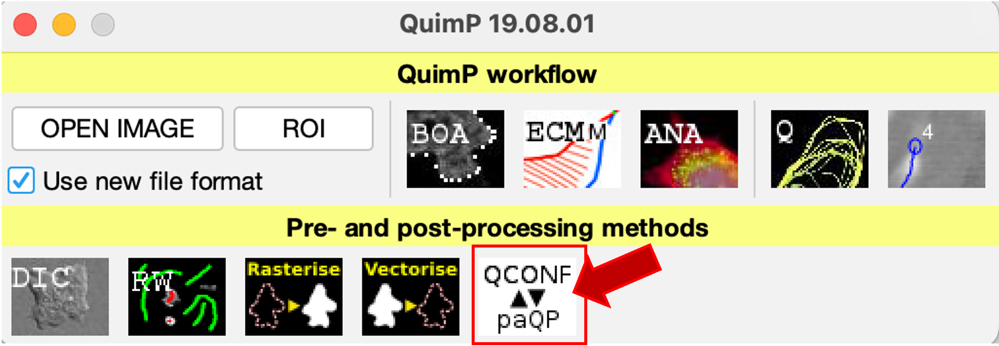
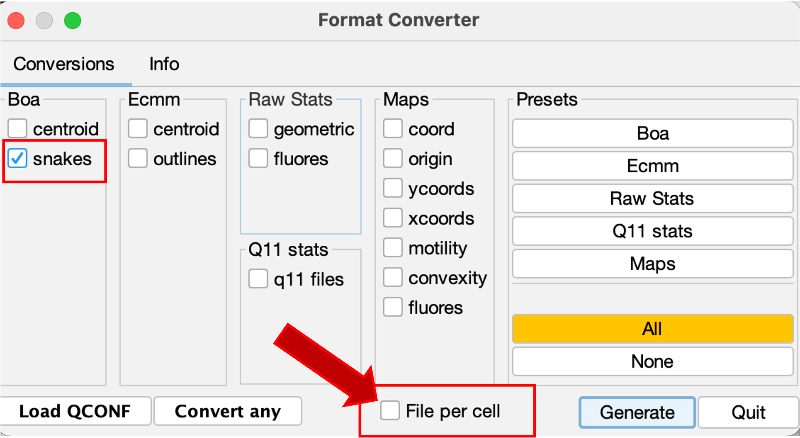

# QuimP_to_AmoePy_bridge
Simple notebok for converting QuimP segmented cell contours to a format that can be imported into Amoepy for downstream analysis of cell morphology over time.

# TODO
- ~~Write instructions to get the sname.csv file from QuimP~~
- Write instructions to run notebook
- ~~Make notebook available on Colab (?)~~
- ~~Add a description of the different snake data types~~
- Add example snake.csv file for testing
- Add option to run on entire directory and save each file individually (?)

# How to use this tool?

You first need to convert the `.QCONF` file containing all the data from the analysis in **QuimP** into a `_snake.csv` file:
1) Open the `QuimP BAR` in **Fiji**
2) Select the `Format Converter` plugin

3) Load the `.QCONF` file containing the contour analysis using the `Load QCONF` button.

4) Select `snakes` and make sure to __unselect__ `File per frame`, so that it reads `File per cell`.

5) You will end up with a `_snake.csv` file for each cell detected in your analysis.

## File formats
The `_snake.csv` is a TAB-sepparated file with the following structure:

In order to be able to be imported into **AmoePy**, the snake contour coordinates need to be converted into a `.txt` file with the following format:

## Running the notebook

The conversion notebook is also available in [Google Colab](https://colab.research.google.com/github/GloBIAS-BioimageAnalysts/QuimP_to_AmoePy_bridge/blob/main/QuimP_to_AmoePy_snake_converter.ipynb)